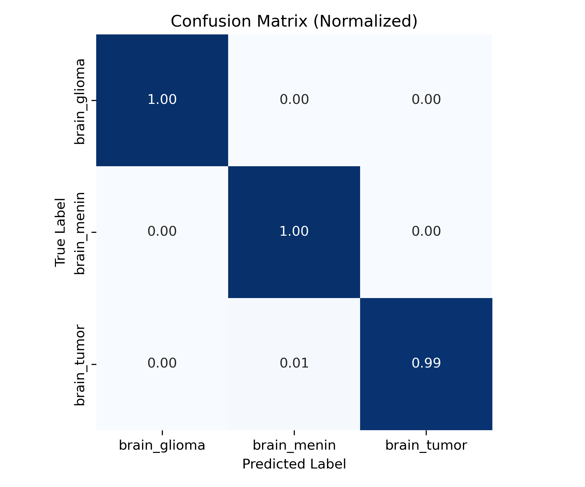
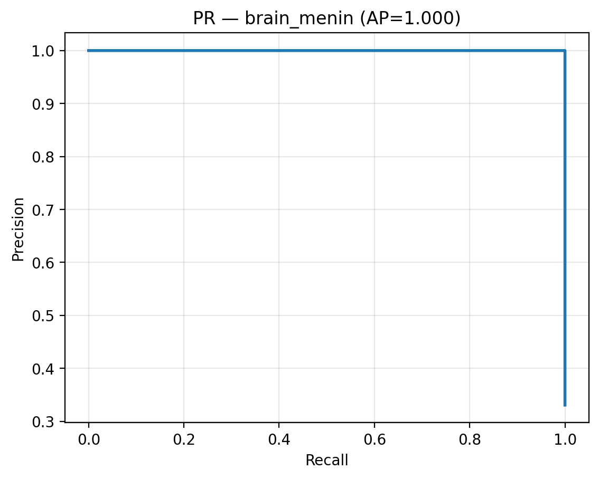
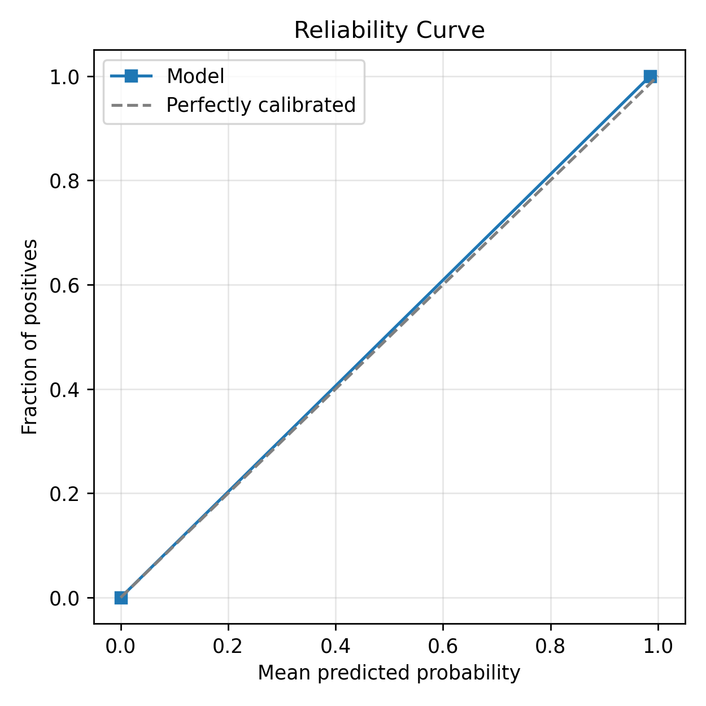
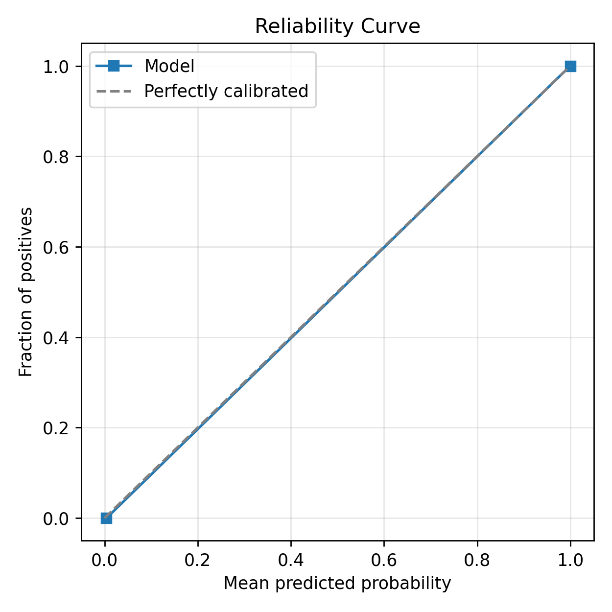
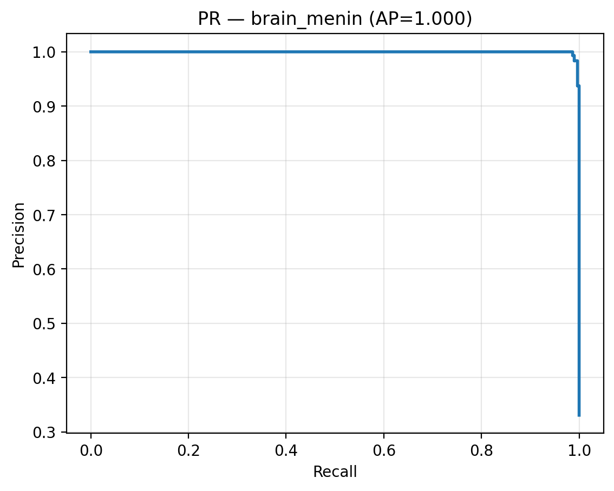
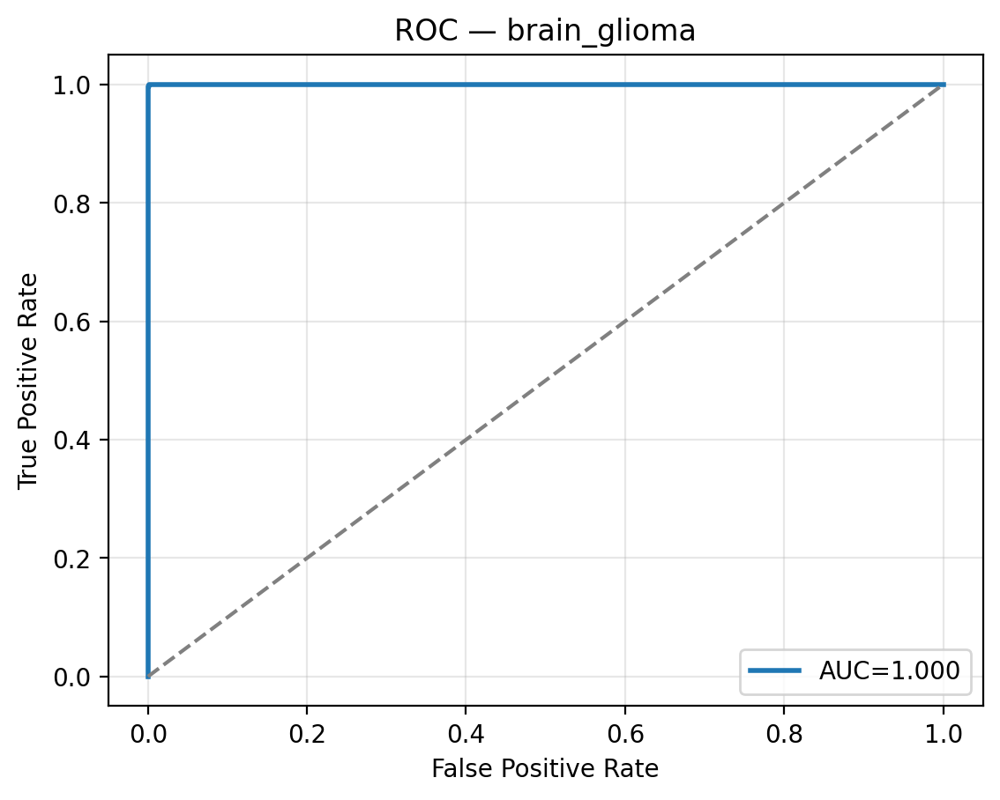
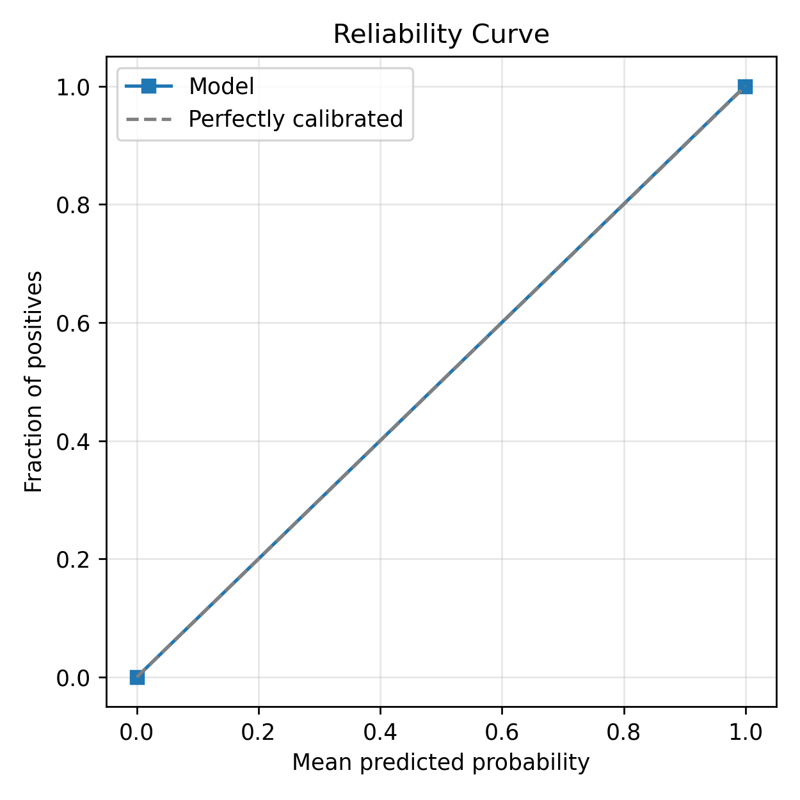
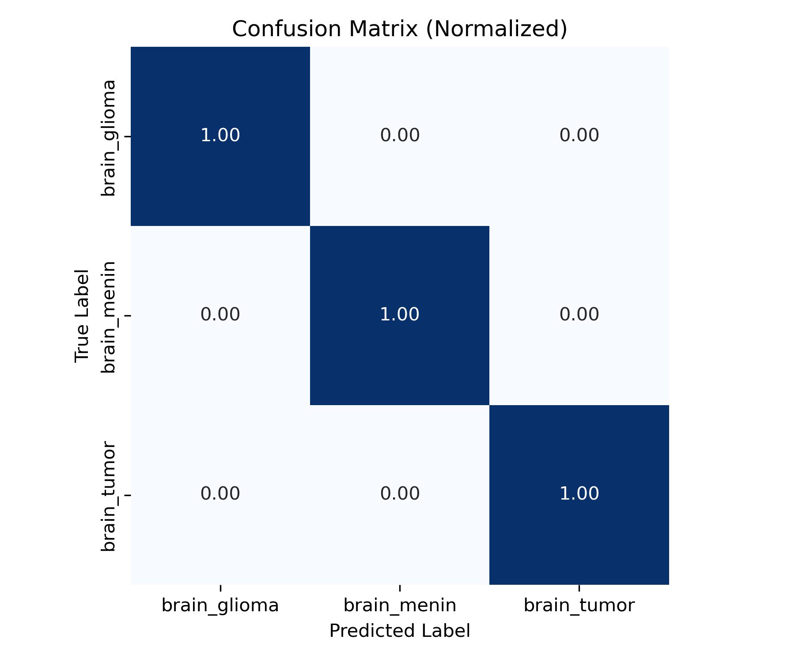
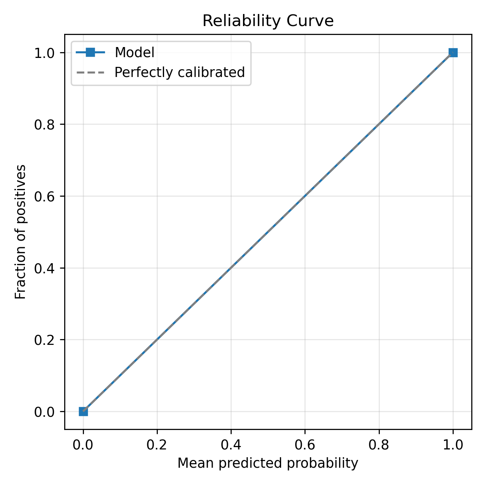

# 🧠 Brain MRI Classifier with 3-Model Grad-CAM System

A complete deep learning pipeline for **brain MRI classification and visualization**, comparing **ResNet50**, **ViT-B/16**, and **ResViT** architectures.

Each model predicts across three tumor classes — **glioma**, **meningioma**, and **pituitary/other tumor** — and produces **Grad-CAM** overlays for interpretability.

> ⚕️ Research and educational demonstration only — not for diagnostic use.

## 📁 Project Overview

This project automates the full workflow:
1. **Dataset preparation** — split raw MRI images into train/val/test  
2. **Model training** — supports ResNet, ViT, and hybrid ResViT  
3. **Evaluation & metrics** — accuracy, macro-F1, AUC, calibration  
4. **Grad-CAM visualization** — interpretable model heatmaps  
5. **Streamlit App** — upload an MRI and visualize all models side-by-side  

---

## 🧩 Classes

| Class ID | Label |
|-----------|--------|
| 0 | 🧠 `brain_glioma` |
| 1 | 🧬 `brain_menin` (meningioma) |
| 2 | 🎯 `brain_tumor` (pituitary/other) |

---

## 🧠 Folder Structure

MRI/
├── app/
│   └── streamlit_app.py             # Interactive Grad-CAM web app
├── src/
│   ├── models/
│   │   ├── resnet.py
│   │   ├── vit.py
│   │   └── resvit.py
│   ├── utils/
│   │   └── gradcam_utils.py
│   └── ...
├── experiments/
│   ├── exp01_resnet/
│   ├── exp02_vit/
│   └── exp03_resvit/
├── data/
│   └── processed/train,val,test/…
└── README.md
### ✅ ResNet50 — `experiments/exp01_resnet/figs/`

**Confusion Matrix**  

**Precision-Recall**

**ROC**

**Calibration (Reliability)**

### ✅ ViT-B/16 — experiments/exp02_vit/figs/

**Confusion Matrix**  

**Precision-Recall**

**ROC**

**Calibration (Reliability)**
| **ViT-B/16** |  |  |  |

### ✅ ResViT — experiments/exp03_resvit/figs/

**Confusion Matrix**  

**Precision-Recall**

**ROC**

**Calibration (Reliability)**
| **ResViT**   |  |  |  |

## 🖥️ Streamlit App

Run:
conda activate torch_gpu
python -m streamlit run app\streamlit_app.py

- Single or 3‑model compare
- **ResViT** CAM toggle: CNN last conv ↔ ViT last block
- Download **Grad‑CAM overlays** as PNG
- Upload an evaluation.json`to auto‑detect trained class order

## 📜 License

MIT (add a LICENSE file if open‑sourcing).
